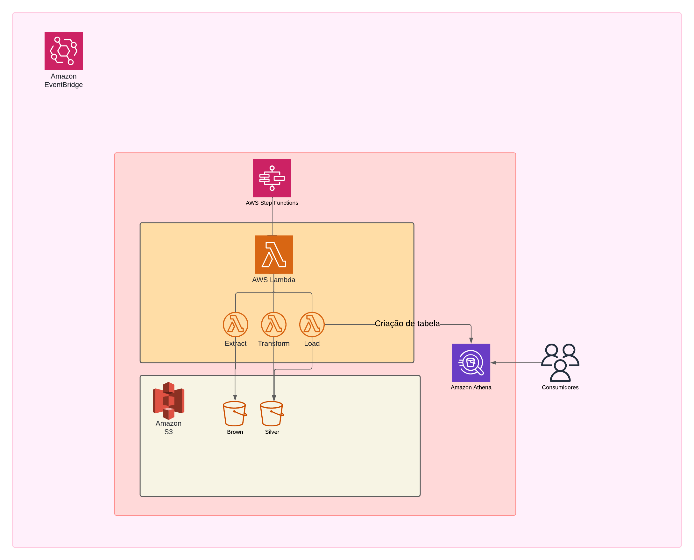

# B3ETL

Este repositório contém o código fonte e os recursos necessários para implementar um pipeline de ETL (Extract, Transform, Load) que extrai dados da API da B3, transforma-os em um formato estruturado e carga-os em um data lake na AWS. O objetivo é fornecer um conjunto de dados consistente e completo para análise do mercado financeiro brasileiro.

**Tecnologias e Serviços AWS:**

**Linguagem:** Python

**Biblioteca:**
- Boto3

**Ferramenta de Manipulação de Dados:** Pandas

**Serviços AWS:**

- S3: Armazena os dados brutos e processados.
- EventBridge: Aciona as funções Lambda com base em eventos (novos arquivos no S3).
- Lambda: Executa as funções de extração, transformação e carga dos dados.
- Step Functions: Orquestra o fluxo do pipeline, definindo as etapas e suas dependências.
- Athena: Permite consultar os dados em formato SQL, facilitando a análise exploratória.

**Fluxo do Pipeline:**

**Extração:** A função extract extrai dados da API da B3 e armazena os dados brutos em um bucket S3 como "brown".

**Transformação:** A função de transformação processa os dados brutos, limpando, padronizando e convertendo-os para um formato estruturado (JSON). Os dados transformados são armazenados em um bucket S3 como "silver".

**Carga:** Os dados transformados são carregados em um data lake S3 para análise posterior.

**Modelo de Dados:**

Os dados são armazenados em formato JSON, oferecendo flexibilidade para diferentes tipos de análise.

**Possibilidades de Análise:**

**Visualizações:** Criação de gráficos e dashboards para explorar tendências e padrões nos dados.

**Machine Learning:** Desenvolvimento de modelos preditivos para prever o comportamento do mercado.

**Análise Temporal:** Estudo de séries temporais para identificar sazonalidades e tendências de longo prazo.

**Informações Adicionais:**

**Fonte de Dados:** [API B3](https://sistemaswebb3-balcao.b3.com.br/featuresDIProxy/DICall/GetRateDI/eyJsYW5ndWFnZSI6InB0LWJyIn0=)

**Estrutura do Repositório:**
- B3ETL
  - diagram (Diagram Image)
  - lambda (Functions)
  - stepfunctions (StateMachine Configuration)

**Estrutura:**

