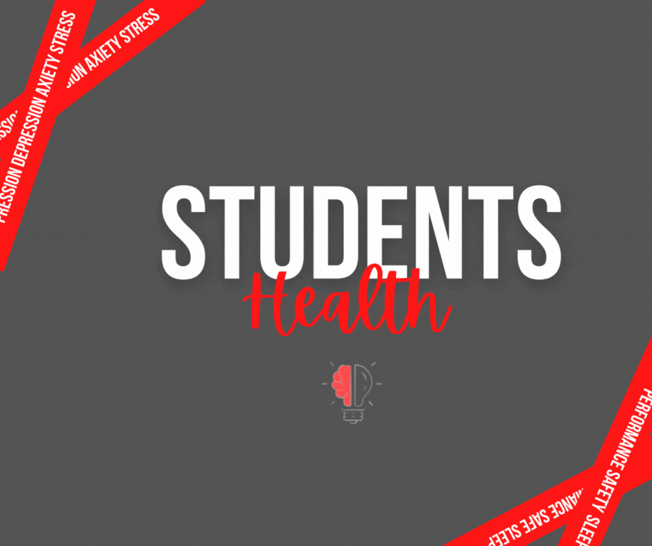

# Student Health

> **Dois de cada três estudantes do 5º e 9º ano do ensino fundamental e 3ª série do ensino médio** da rede estadual **relatam sintomas de depressão e ansiedade**. Foi o que apontou um _mapeamento desenvolvido pela_ Secretaria da Educação do Estado de São Paulo e o Instituto Ayrton Senna, que contou com a participação de 642 mil alunos no âmbito do SARESP (Sistema de Avaliação de Rendimento Escolar do Estado de São Paulo).
> 
> [Em mapeamento, 70% dos estudantes avaliados relatam sintomas de depressão e ansiedade  - Secretaria da Educação do Estado de São Paulo (educacao.sp.gov.br)](https://www.educacao.sp.gov.br/em-mapeamento-70-dos-estudantes-avaliados-relatam-sintomas-de-depressao-e-ansiedade/)

Com base na problemática apresentada, fica evidente a necessidade intrínseca de abordar tratativas para esse cenário. Ignorá-lo, independentemente do contexto, não seria apropriado. Embora uma abordagem homogênea ou generalista possa ser tentadora em um ambiente estudantil, é improvável que tenha a mesma eficácia que uma abordagem específica, que leva em consideração padrões nas características individuais dos alunos e vá ao cerne dos possíveis conflitos.

Nesse sentido, proponho a coleta de dados vitais que afetam qualitativamente a vida dos estudantes, de maneira respeitosa e voluntária. A análise exploratória desses dados, aliada a modelos de Machine Learning (ML), nos fornecerá uma base sólida para elaborar tratativas e planejar ações que promovam melhorias nos casos mais críticos e apoiem a manutenção do estado saudável. Dessa forma, poderemos obter resultados qualitativos significativos em relação à saúde mental dos alunos.

Para exemplificar essa abordagem, realizamos uma extração e análise de dados do Kaggle, demonstrando como esse processo pode ser aplicado e os resultados obtidos.

 ---------

## Etapas:

### Coleta

- **Quantidade de alunos:** 1100

- **Fatores colhidos:**
  
  - Nível de ansiedade
  
  - Nível de autoestima
  
  - Nível de estresse
  
  - Depressão
  
  - Qualidade de sono
  
  - Anomalia respiratória
  
  - Nível Sonoro
  
  - Segurança
  
  - Necessidade básicas
  
  - Nível performance acadêmica
  
  - Carga horária de estudo
  
  - Nível de relação entre o aluno e professor
  
  - Apoio social
  
  - Pressão de grupo
  
  - Carga de atividades extra-curriculares
  
  - Bullying
  
  - Condições de vida
  
  - Dores de cabeça
    
    

### Resultados

Utilizando algoritmo de clusterização (KMeans) tendo os dados acima como matéria-prima, conseguimos identificar 3 grupos presentes, com base nas análises pós-treinamento e classificação dos mesmos, é possível analisar as características destes grupos.

#### Grupos

1. **Grupo 0**: Este grupo contém estudantes com os menores níveis de performance e saúde mental. Eles podem estar enfrentando desafios acadêmicos e emocionais.

2. **Grupo 1**: Este grupo contém estudantes com os maiores níveis de performance e saúde mental. Eles podem ser os mais bem-sucedidos em termos acadêmicos e também têm boa saúde mental.

3. **Grupo 2**: Este grupo parece ser uma categoria intermediária. Os estudantes aqui têm desempenho semelhante ao Grupo 0, mas estão em um estado melhor em relação à saúde mental.

É interessante observar como esses grupos se distinguem e como suas características variam. As visualizações devem fornecer insights valiosos para entender melhor esses padrões, segue uma amostra abaixo:

--------

#### Conclusão

Essas visualizações acima nos mostram apenas a ponta do iceberg. Temos um cenário positivo, mas também um negativo. Esses cenários são fruto de fatores preponderantes, e podemos observá-los de forma mais explícita quando analisamos cada um em detalhes. Ao ter essa visão micro, torna-se possível estudar e elaborar ações personalizadas para cada grupo, aumentando a eficácia e eficiência das tratativas. Utilizando um modelo de classificação baseado em dados, podemos proporcionar uma melhor experiência aos alunos e, consequentemente, observar melhorias nos níveis de desempenho. Isso contribui para um ambiente mais saudável e empático como um todo.

Quanto à sugestão de nomeação dos grupos por severidade:

1. **Crítico**
2. **Mediano**
3. **Saudável**

